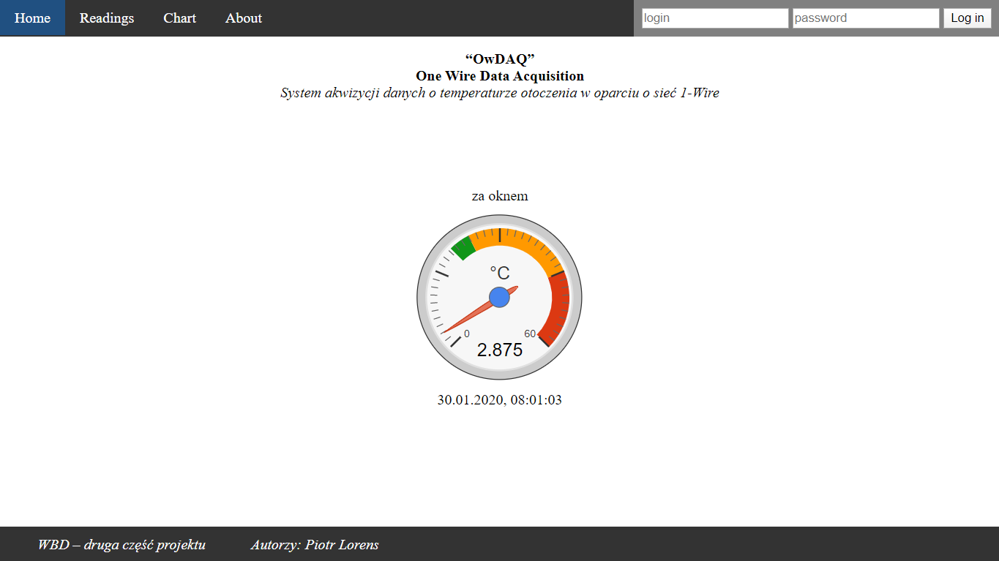
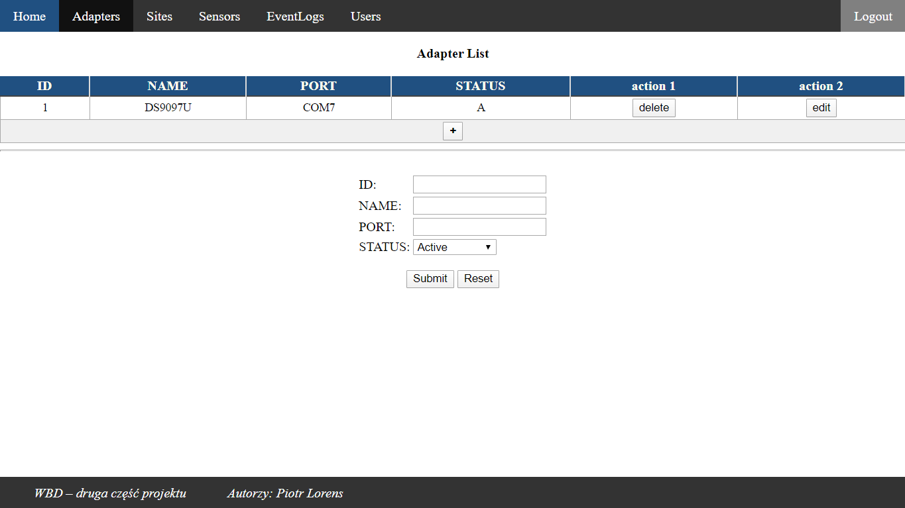

# One wire data acquisition

**Projekt i implementacja systemu akwizycji danych o temperaturze otoczenia w oparciu o  sieć 1-Wire** 

Celem projektu jest zbudowanie systemu akwizycji danych pomiarowych (temperatura)
współpracującego z siecią 1-Wire i posiadającego wielodostępne interfejsy - GUI dla człowieka oraz API dla
użytkowników aplikacyjnych (np. wizualizacje w LabVIEW)

System ma współpracować z dowolną, konfigurowalną ilością czujników temperatury, ustawienia systemu
jak i dane pomiarowe mają być przechowywane w zdalnej, relacyjnej bazie danych.

|Model & schema|
|------------------------------------|
||
||


|guest panel|
|------------------------------------|
||
| |admin panel|
||


|admin panel|
|------------------------------------|
||
||
||
||
||


### Tech

* Java SE 8
* Spring boot
* Apache Maven
* Oracle Database 18c Express Edition (XE) 
* OneWireAPI
* Thymeleaf


### Development

Adding maven libraries

```
mvn install:install-file -Dfile=OneWireAPI.jar -DgroupId=additional.libs -DartifactId=OneWireAPI-lib -Dversion=1.0 -Dpackaging=jar -DgeneratePom=true
```
```
mvn install:install-file -Dfile=RXTXcomm.jar -DgroupId=additional.libs -DartifactId=RXTXcomm-lib -Dversion=1.0  -Dpackaging=jar -DgeneratePom=true
```
```
mvn install:install-file -Dfile= ojdbc8.jar -DgroupId=com.oracle -DartifactId=ojdbc8 -
Dversion=12.2.0.1 -Dpackaging=jar
```


### Todos

 - Dodanie indykatorów zdarzeń alarmowych (przekroczeń wartości temperatury, awarii lub niedostępności czujników)
 - Dodanie obsługi czujników wilgotności 
